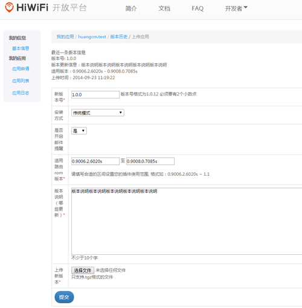
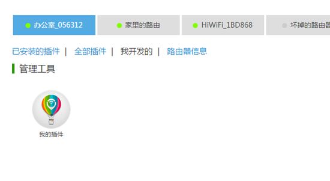
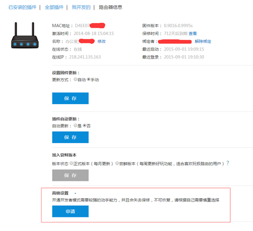
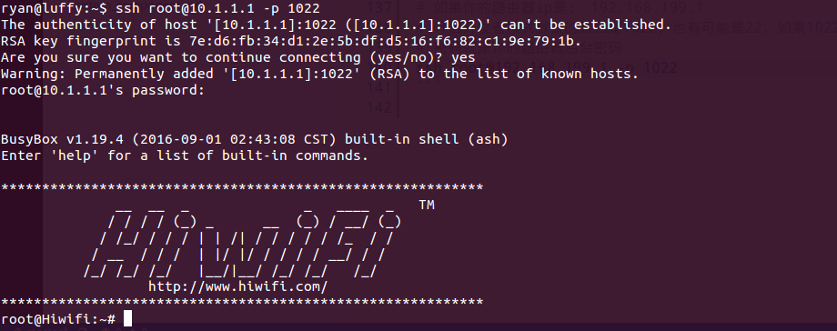

# Getting Started
此文档目的是为了让开发者熟悉整个流程，快速开发一个可以输出hello world的插件。
## 申请开发者
### 认证地址：[点击申请认证](https://open.hiwifi.com/open.php?m=user&a=add)
### 申请认证需要注意的地方：
* 个人开发者注意上传的图片是手持身份证的照片；
* 在项目经验中写关于linux和openwrt方面的开发经验。在这些方面不熟悉的人，需要恶补很多linux知识。

## 开始之前
### 存储设备
* 插件是依赖于外部存储的，请确认路由器上有存储设备，并预留有安装插件的空间。
* 支持内存卡和usb的路由器，插件存储位置默认位于内存卡上，所以经务必插入内存卡再开始下面的教程。
* 如果路由器上只有 usb 接口，那插件存储位置默认位于usb设备上，所以经务必插入内存卡再开始下面的教程。
* 例外，HC5961 HC5962，因为flash够大，所以无需外置存储。

## 创建插件
* 创建插件请点击： [链接地址](https://open.hiwifi.com/open.php?m=myapp&a=apply)
* 如果是第一次练手测试，在应用发布范围里面勾选 “仅限自己开发测试使用”，如下图


这个选项的应用不需要官方审核，创建应用之后可以直接上传插件版本测试。
如果不勾选，需要通过官方审核才可以继续上传插件版本。


## 开发插件
### 以插件名称新建目录
此目录存放插件的代码，比如叫demo_test

建议用版本管理器来管理代码，例如： git，svn

### 插件里的必要文件

插件至少包括两个文件，插件属性描述（manifest.json）和插件运行文件（script）

manifest.json文件：
```javascript
{
   "manifest_version": "2.0.0",
   "supportgetappstatus": 1
}
```

script文件：
```bash

script_running='/tmp/t.lock'


## 可以显示的从页面中点击启动按钮的时候调用
start() {
    touch $script_running
	return 0
}

## 可以显示的从页面中点击停止按钮的时候调用
stop() {
	rm $script_running
	return 0
}

## 从服务端获取状态的时候调用
status() {
    local cur_date=`date "+%Y-%m-%d %H:%M:%S"`
    if [ -e $script_running ]; then
        echo '{ "status" : "running",  "msg": "Router Time: '$cur_date'"}'
    else
        echo '{ "status" : "stopped",  "msg": "Router Time: '$cur_date'"}'
    fi	
}

## 安装的时候调用
install() {
	start
	return 0
}

## 卸载的时候调用
uninstall() {
	stop
	return 0
}

```
### 打包插件版本
在插件开发目录的上一级目录，执行下面脚本，在本例中，appname=demo_test
```bash
#!/bin/sh

[ $# -lt 1 ] && {
    cat <<EOF
Usage:
    $0 <appname>    
EOF
    exit
}

appname=$1
(cd $appname && tar -czvf ${appname}.tgz * --exclude-vcs && mv ${appname}.tgz ../)
[ $? -eq 0 ] && echo "Done: ${appname}.tgz"
```

## 上传版本
将刚才的压缩包上传到服务器，页面类似下面：



需要注意的是插件的版本号，建议是：x.x.x，比如 1.3.1。
## 安装测试

是不是想试一下插件安装到路由器上的感觉？ 到绑定的路由器，有一个我开发的tab，类似下图：



安装之后，刷新状态，可以看到输出的时间：


安装失败时，如何看安装过程的log
[查看安装插件过程的log](https://open.hiwifi.com/open.php?m=myapp&a=myapplog)
选择对应的路由器和插件，就可以看到对应的日志

### 安装的时候提示需要存储，怎么办？
鉴于以前有部分开发者插件比较大，但是没有把插件存放到外存上，导致路由器不稳定，遂把插件的一个选项没有开放出来：插件是放到Flash中还是外存中。
有两个方法解决这个问题：
1. 购买一个SD卡或者TF卡插到路由器上；
2. 加QQ群： 296254584，请群主帮忙处理一下。
后续会把这个选项开放出来，就不用这么复杂了。


## 路由器开通ROOT(可选)
为了方便直接在路由上直接开发测试插件，极路由开放了路由器的root权限给开发者。申请具体方法如下：
app.hiwifi.com首页->选中要申请的路由器-> 路由器信息->高级设置->"+"->申请（开通开发者模式）->同意各种条款（需要注意的是开通ROOT之后，路由器就失去了保修资格）->结束。
账号需要绑定手机号，没有绑定的话，绑定一个手机号。
安装开发者模式插件之后，就可以以root身份ssh进入路由。




### 如何ssh进入路由器
```bash
# 如果你的路由器ip是： 192.168.199.1
# 开启开发者模式默认的端口是1022，也有可能是22，如果1022不行的话，试一下22端口
# 密码就是你的路由器后台密码
ssh root@192.168.199.1 -p 1022
```

